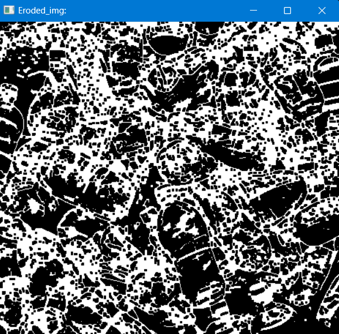

# Chapter 2: Basic Functions 
## I. Convert to Gray Image
```Python
import cv2
img = cv2.imread("C:\Python\OpenCv_All_In_One\Data_Test\Image\Garbage_Img.png")

gray_img = cv2.cvtColor(img, cv2.COLOR_BGR2GRAY)
cv2.imshow("Gray_img:", gray_img)
cv2.waitKey(0)
```
Kết quả:
---

---

## II. Convert to Blur Image
```python
import cv2
img = cv2.imread("C:\Python\OpenCv_All_In_One\Data_Test\Image\Garbage_Img.png")

gray_img = cv2.cvtColor(img, cv2.COLOR_BGR2GRAY)
blur_img = cv2.GaussianBlur(gray_img, (7, 7), 0)

cv2.imshow("Blur_img:", blur_img)
cv2.waitKey(0)
```
Kết quả:
---

---

## III. Edge Detector
```python
import cv2
img = cv2.imread("C:\Python\OpenCv_All_In_One\Data_Test\Image\Garbage_Img.png")

canny_img = cv2.Canny(img, 100, 100) 

cv2.imshow("Canny_img:", canny_img)
cv2.waitKey(0)
```
Kết quả:
---

---

**Định nghĩa về Threadsold:** Thresholding trong computer vision là quá trình chuyển một ảnh màu hoặc ảnh xám thành ảnh nhị phân (black-and-white) bằng cách so sánh các giá trị pixel với một ngưỡng (threshold) nhất định. Nếu giá trị pixel lớn hơn ngưỡng, pixel đó sẽ được gán giá trị trắng (255), còn nếu nhỏ hơn ngưỡng, nó sẽ được gán giá trị đen (0).

---

**Trong hàm `cv2.Canny(img, 100, 100)`, hai giá trị 100 đại diện cho hai ngưỡng trong thuật toán Canny edge detection:** 
- Ngưỡng thấp (low threshold): Giá trị bên trái (100) là ngưỡng thấp. Các pixel có giá trị gradient lớn hơn ngưỡng thấp này và nhỏ hơn ngưỡng cao sẽ được xem xét là có thể là biên.
- Ngưỡng cao (high threshold): Giá trị bên phải (100) là ngưỡng cao. Các pixel có giá trị gradient lớn hơn ngưỡng cao này sẽ chắc chắn được xem là biên. Nếu một pixel có giá trị gradient nhỏ hơn ngưỡng thấp, nó sẽ không được xem là biên.


## IV. Dilating Image (Giãn nở ảnh)

**Định nghĩa:**
Hàm `cv2.dilate` trong OpenCV được sử dụng để dilating (giãn nở) một ảnh nhị phân. Nó là một kỹ thuật trong xử lý ảnh giúp mở rộng các vùng sáng (hoặc màu trắng) trong ảnh nhị phân. Quá trình này giúp mở rộng các đối tượng sáng hoặc xóa bỏ các lỗ hổng nhỏ trong ảnh.

**Cách hoạt động:**
- Kernel (hoặc phần tử cấu trúc) là một ma trận nhỏ, thường có kích thước 3x3 hoặc 5x5, dùng để kiểm tra từng pixel của ảnh.
- Kỹ thuật giãn nở sẽ di chuyển kernel qua toàn bộ ảnh. Tại mỗi vị trí, nếu ít nhất một pixel trong kernel có giá trị sáng (255), pixel trung tâm của kernel sẽ được gán giá trị sáng (255). Nếu không, pixel trung tâm sẽ giữ giá trị ban đầu.

**Ứng dụng:**
- Loại bỏ nhiễu: Giãn nở giúp làm mịn ảnh và loại bỏ các điểm nhiễu nhỏ.
- Kết nối các phần rời rạc: Làm cho các đối tượng trong ảnh nhị phân trở nên liên tục hơn.
- Mở rộng các đối tượng: Tăng kích thước các đối tượng sáng trong ảnh.
```python
import cv2
import numpy as np

img = cv2.imread("C:\Python\OpenCv_All_In_One\Data_Test\Image\Garbage_Img.png")
kernel = np.ones((3, 3), np.uint8)

canny_img = cv2.Canny(img, 100, 100)
dilation_img = cv2.dilate(canny_img, kernel, iterations=1)

cv2.imshow("Canny_img:", canny_img)
cv2.imshow("Dilation_img:", dilation_img)
cv2.waitKey(0)
```

Kết quả:
---

---

## V. Eroded Image (Xói mòn ảnh)
**Định nghĩa:**
Hàm cv2.erode trong OpenCV là đối ngược với cv2.dilate. Thay vì mở rộng các đối tượng sáng (hoặc trắng) trong ảnh nhị phân, erosion (xói mòn) sẽ làm giảm kích thước các đối tượng sáng, và loại bỏ các vùng nhỏ không liên tục.

**Cách hoạt động:**
- Kernel (hoặc phần tử cấu trúc) vẫn là một ma trận nhỏ, như trong trường hợp của cv2.dilate.
- Kỹ thuật xói mòn sẽ di chuyển kernel qua toàn bộ ảnh. Tại mỗi vị trí, nếu tất cả các pixel trong kernel đều có giá trị sáng (255), pixel trung tâm sẽ giữ giá trị sáng (255). Nếu có bất kỳ pixel nào trong kernel có giá trị tối (0), pixel trung tâm sẽ trở thành tối (0).

**Ứng dụng:**
- Loại bỏ nhiễu: Giảm các đối tượng nhỏ không liên tục.
- Thu hẹp các đối tượng sáng: Làm nhỏ các đối tượng sáng trong ảnh.
- Tách các đối tượng gần nhau: Xói mòn có thể giúp tách các đối tượng sáng gần nhau trong ảnh nhị phân.

```python
import cv2
import numpy as np

img = cv2.imread("C:\Python\OpenCv_All_In_One\Data_Test\Image\Garbage_Img.png")
kernel = np.ones((3, 3), np.uint8)

canny_img = cv2.Canny(img, 100, 100)
dilation_img = cv2.dilate(canny_img, kernel, iterations=1)
Eroded_img = cv2.erode(dilation_img, kernel, iterations=1)

cv2.imshow("Canny_img:", canny_img)
cv2.imshow("Dilation_img:", dilation_img)
cv2.imshow("Eroded_img:", Eroded_img)
cv2.waitKey(0)
```

Kết quả:
---

---