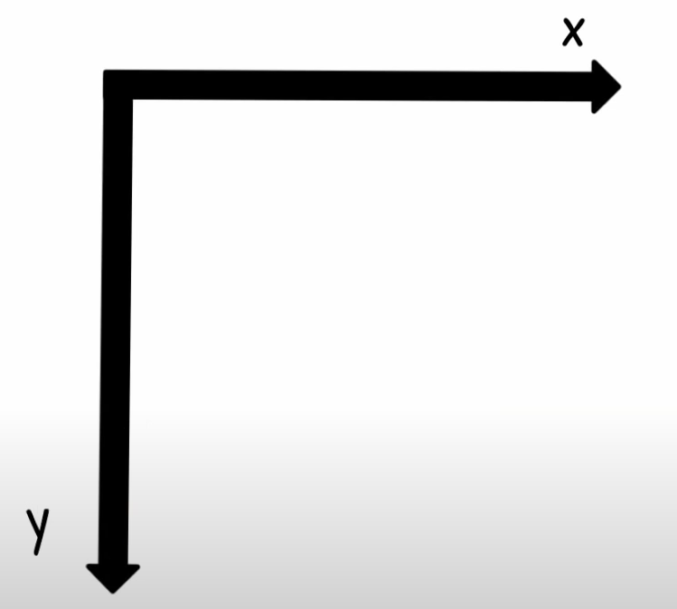
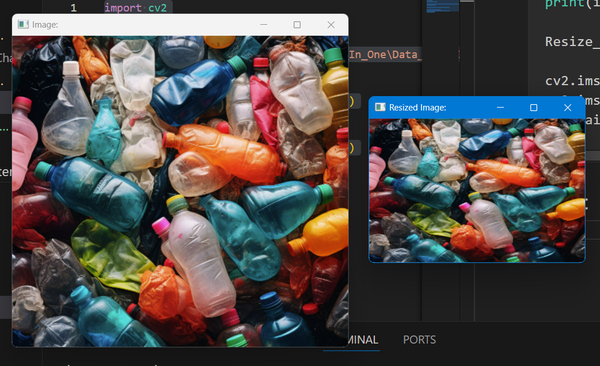
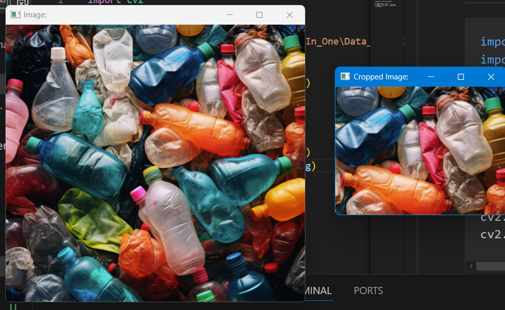

# Chapter 3: Resizing and Cropping
## I. OpenCv Convention (Quy Uoc OpenCv)

## II. Resizing images
```python
import cv2
import numpy as np

img = cv2.imread("C:\Python\OpenCv_All_In_One\Data_Test\Image\Garbage_Img.png")
print(img.shape)

Resize_img = cv2.resize(img, (300, 200))

cv2.imshow("Image:", img)
cv2.imshow("Resized Image:", Resize_img)
cv2.waitKey(0)
```

Result:
---

---

## III. Croping Image
```python
import cv2
import numpy as np

img = cv2.imread("C:\Python\OpenCv_All_In_One\Data_Test\Image\Garbage_Img.png")

cropped_img = img[0:200, 200:500]

cv2.imshow("Image:", img)
cv2.imshow("Cropped Image:", cropped_img)
cv2.waitKey(0)
```
Result:
---

---