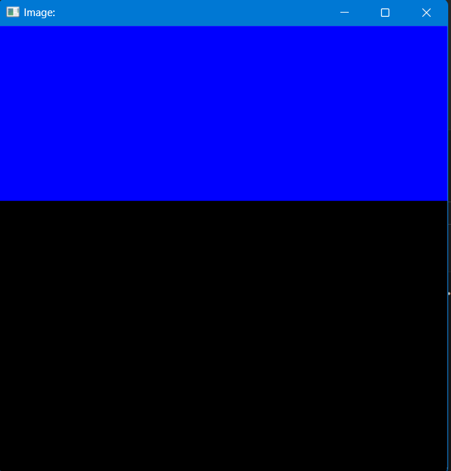
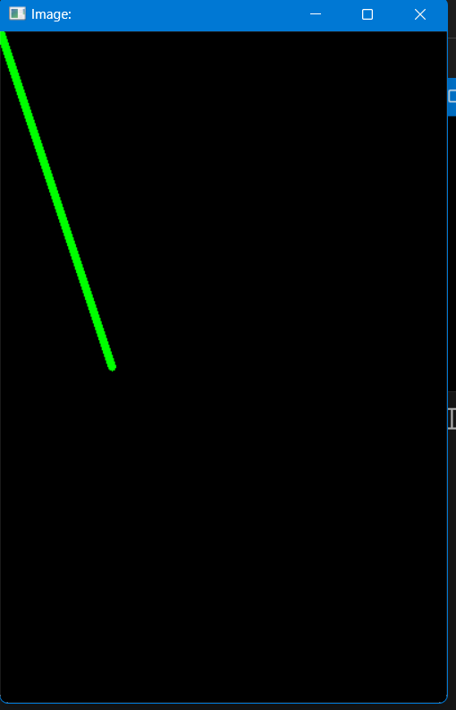
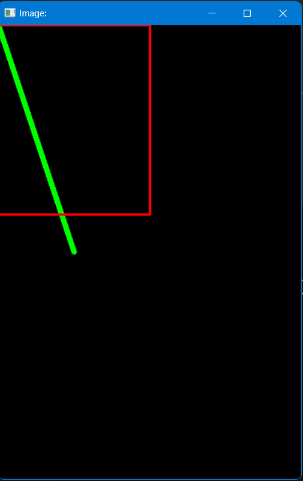
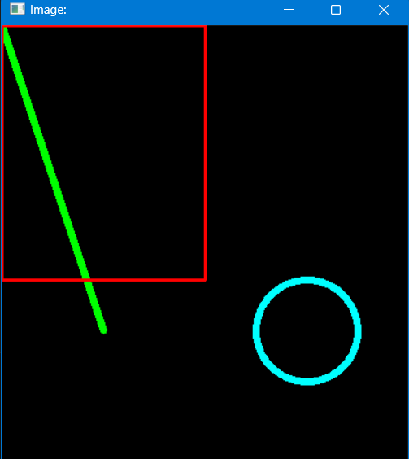
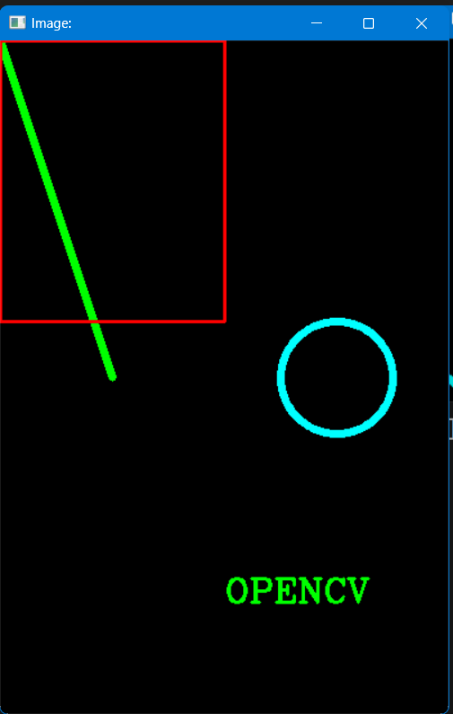

# Chapter 4: Shapes and Text
## I. Shapes
### 1. Color 
```python
import cv2
import numpy as np

img = np.zeros((512, 512, 3), np.uint8)
print(img.shape)

img[0:200,:] = 255,0,0

cv2.imshow("Image:", img)
cv2.waitKey(0)
```
Result:
---

---
### 2. Line
```python
import cv2
import numpy as np

img = np.zeros((600, 400, 3), np.uint8)

cv2.line(img, (0, 0), (100, 300), (0, 255, 0), 5)

cv2.imshow("Image:", img)
cv2.waitKey(0)
```
Result:
---

---

### 3. Rectangle
```python
import cv2
import numpy as np

img = np.zeros((600, 400, 3), np.uint8)

cv2.line(img, (0, 0), (100, 300), (0, 255, 0), 5)
cv2.rectangle(img, (0,0), (200, 250), (0, 0, 255), 2)
cv2.imshow("Image:", img)
cv2.waitKey(0)
```
Result:
---

---

**Note:**
You can put `cv2.FILLED` in code, for example `cv2.rectangle(img, (0,0), (200, 250), (0, 0, 255), cv2.FILLED)` to fill full the rectangle 

### 4. Circle
```python
import cv2
import numpy as np

img = np.zeros((600, 400, 3), np.uint8)
# print(img.shape)

# img[0:200,:] = 255,0,0

cv2.line(img, (0, 0), (100, 300), (0, 255, 0), 5)
cv2.rectangle(img, (0,0), (200, 250), (0, 0, 255), 2)
cv2.circle(img, (300, 300), 50, (255, 255, 0), 5)

cv2.imshow("Image:", img)
cv2.waitKey(0)
```
Result:
---

---

## II. Text

```python
import cv2
import numpy as np

img = np.zeros((600, 400, 3), np.uint8)
# print(img.shape)

# img[0:200,:] = 255,0,0

cv2.line(img, (0, 0), (100, 300), (0, 255, 0), 5)
cv2.rectangle(img, (0,0), (200, 250), (0, 0, 255), 2)
cv2.circle(img, (300, 300), 50, (255, 255, 0), 5)
cv2.putText(img, "OPENCV ", (200, 500), cv2.FONT_HERSHEY_COMPLEX, 1, (0, 255, 0), 2)


cv2.imshow("Image:", img)
cv2.waitKey(0)
```
Result:
---

---