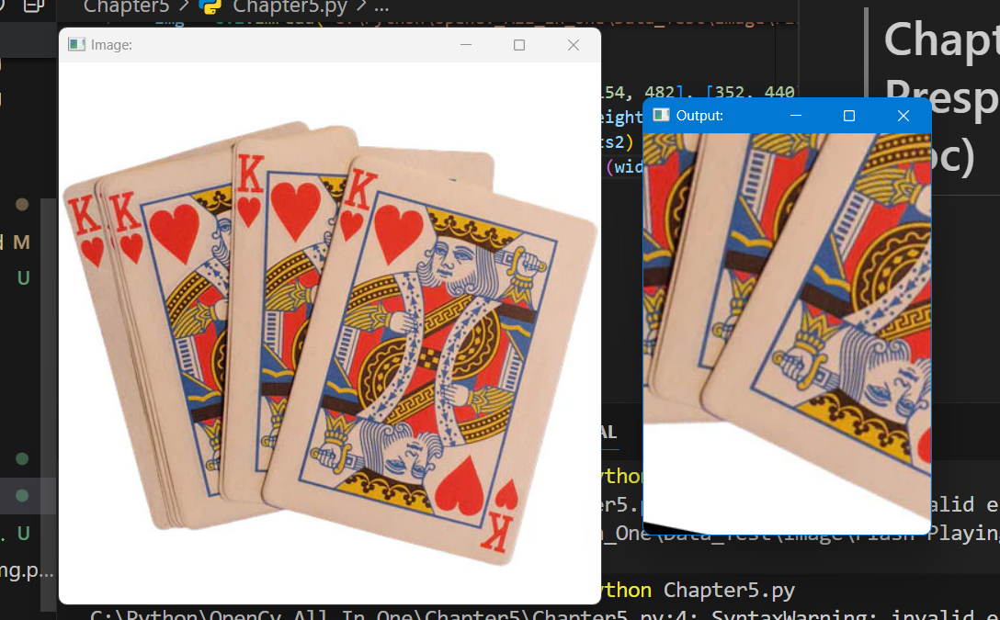

# Chapter 5: Warp Prespective (Phối cảnh dọc)
```python
import cv2
import numpy as np

img = cv2.imread("C:\Python\OpenCv_All_In_One\Data_Test\Image\Flash-Playing-card-king-of-hearts.webp")

width, height = 250, 350
pts1 = np.float32([[111, 219], [287, 188], [154, 482], [352, 440]])
pts2 = np.float32([[0, 0], [width, 0], [0, height], [width, height]])
matrix = cv2.getPerspectiveTransform(pts1, pts2)
imgOutput = cv2.warpPerspective(img, matrix, (width, height))

print(img.shape)
cv2.imshow("Image:", img)
cv2.imshow("Output:", imgOutput)
cv2.waitKey(0)
```
Result:
---

---

**Explain Code**  
1. Đọc ảnh từ đường dẫn `(cv2.imread)`.
2. Xác định 4 điểm trong ảnh gốc `(pts1)` và 4 điểm tương ứng trong ảnh đích `(pts2)`.
3. Tính ma trận biến đổi phối cảnh từ pts1 sang pts2 `(cv2.getPerspectiveTransform)`.
4. Áp dụng biến đổi phối cảnh để tạo ra ảnh mới có kích thước xác định `(cv2.warpPerspective)`.
5. Hiển thị ảnh gốc và ảnh kết quả `(cv2.imshow)`, chờ nhấn phím để đóng cửa sổ `(cv2.waitKey)`.