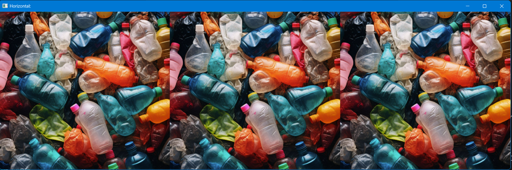
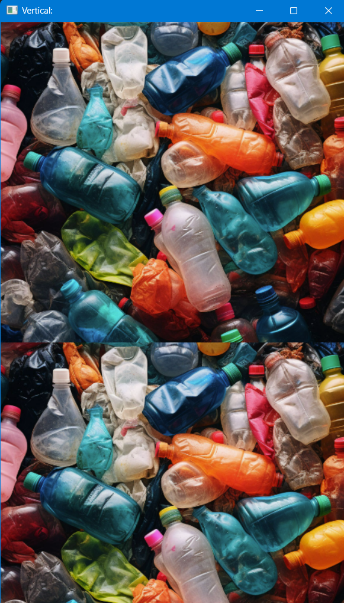

# Chapter 6: Joining Images
## I. Horizontal Image 
```python
import cv2
import numpy as np

img = cv2.imread("C:\Python\OpenCv_All_In_One\Data_Test\Image\Garbage_Img.png")

hor_img = np.hstack((img, img, img))

cv2.imshow("Horizontal:", hor_img)
cv2.waitKey(0)
```

Result:
---

---

## II. Vertical Image
```python
import cv2
import numpy as np

img = cv2.imread("C:\Python\OpenCv_All_In_One\Data_Test\Image\Garbage_Img.png")

ver_img = np.vstack((img, img))

cv2.imshow("Vertical:", ver_img)
cv2.waitKey(0)
```
Result:
---

---

**Note**  
1. Dùng `np.hstack` để ghép 3 ảnh img thành một hàng ngang.  
2. Dùng `np.vstack` để ghép 2 ảnh img thành một cột dọc.