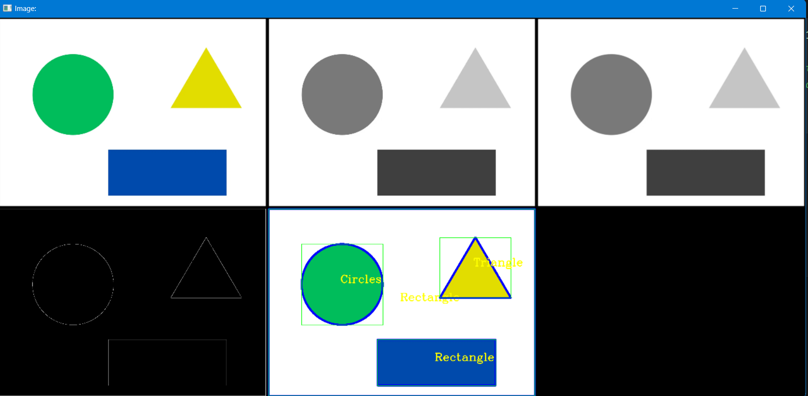

# Chapter 8: Contour / Shape Detection 
```python
import cv2
import numpy as np

# Hàm để sắp xếp và hiển thị nhiều ảnh cùng lúc
def stackImages(scale, imgArray):
    rows = len(imgArray)
    cols = len(imgArray[0])
    rowsAvailable = isinstance(imgArray[0], list)
    width = imgArray[0][0].shape[1]
    height = imgArray[0][0].shape[0]
    if rowsAvailable:
        for x in range(0, rows):
            for y in range(0, cols):
                if imgArray[x][y].shape[:2] == imgArray[0][0].shape[:2]:
                    imgArray[x][y] = cv2.resize(imgArray[x][y], (0, 0), None, scale, scale)
                else:
                    imgArray[x][y] = cv2.resize(imgArray[x][y], (imgArray[0][0].shape[1], imgArray[0][0].shape[0]), None, scale, scale)
                if len(imgArray[x][y].shape) == 2:
                    imgArray[x][y] = cv2.cvtColor(imgArray[x][y], cv2.COLOR_GRAY2BGR)
        hor = [np.zeros((height, width, 3), np.uint8)] * rows
        for x in range(0, rows):
            hor[x] = np.hstack(imgArray[x])
        ver = np.vstack(hor)
    else:
        for x in range(0, rows):
            if imgArray[x].shape[:2] == imgArray[0].shape[:2]:
                imgArray[x] = cv2.resize(imgArray[x], (0, 0), None, scale, scale)
            else:
                imgArray[x] = cv2.resize(imgArray[x], (imgArray[0].shape[1], imgArray[0].shape[0]), None, scale, scale)
            if len(imgArray[x].shape) == 2:
                imgArray[x] = cv2.cvtColor(imgArray[x], cv2.COLOR_GRAY2BGR)
        ver = np.hstack(imgArray)
    return ver

# Hàm tìm và xử lý contour từ ảnh
def get_contours(img):
    # Tìm các contour và hierarchy
    contours, hierarchy = cv2.findContours(img, cv2.RETR_TREE, cv2.CHAIN_APPROX_NONE)
    for i, cnt in enumerate(contours):
        if hierarchy[0][i][3] != -1:  # Kiểm tra contour nằm bên trong (có parent)
            area = cv2.contourArea(cnt)  # Tính diện tích contour
            print(f"Contour {i}: Area = {area}")
            if area > 500:  # Chỉ xử lý contour lớn hơn 500 pixel
                cv2.drawContours(contour_img, [cnt], -1, (255, 0, 0), 10)  # Vẽ contour
                peri = cv2.arcLength(cnt, True)  # Tính chu vi
                approx = cv2.approxPolyDP(cnt, 0.02 * peri, True)  # Tìm các đỉnh
                objCor = len(approx)  # Số góc
                x, y, w, h = cv2.boundingRect(approx)  # Vẽ khung bao

                # Xác định loại hình dạng dựa trên số góc
                if objCor == 3:
                    objectType = "Triangle"
                elif objCor == 4:
                    aspRatio = w / float(h)  # Tính tỷ lệ khung bao
                    if 0.98 < aspRatio < 1.03:
                        objectType = "Square"
                    else:
                        objectType = "Rectangle"
                elif objCor > 4:
                    objectType = "Circle"
                else:
                    objectType = "None"

                # Vẽ khung chữ nhật và ghi tên hình dạng
                cv2.rectangle(contour_img, (x, y), (x + w, y + h), (0, 255, 0), 2)
                cv2.putText(contour_img, objectType, (x + (w // 2) - 10, y + (h // 2) - 10),
                            cv2.FONT_HERSHEY_COMPLEX, 2, (0, 255, 255), 3)

# Đọc ảnh
path = "C:\Python\OpenCv_All_In_One\Data_Test\Image\shape_img2.webp"
img = cv2.imread(path)
contour_img = img.copy()  # Tạo bản sao ảnh gốc để vẽ contour

# Tiền xử lý ảnh
gray_img = cv2.cvtColor(img, cv2.COLOR_BGR2GRAY)  # Chuyển ảnh sang grayscale
blur_img = cv2.GaussianBlur(gray_img, (7, 7), 1)  # Làm mờ ảnh
canny_img = cv2.Canny(blur_img, 50, 50)  # Phát hiện cạnh
black_img = np.zeros_like(img)  # Ảnh nền đen để hiển thị

# Gọi hàm xử lý contour
get_contours(canny_img)

# Hiển thị ảnh theo từng bước
stack_img = stackImages(0.3, ([img, gray_img, blur_img], [canny_img, contour_img, black_img]))
cv2.imshow("Image:", stack_img)
cv2.waitKey(0)

```

Reslut:
---

---

**Summarize:**
1. Đầu vào: Ảnh shape_img2.webp.  
2. Tiền xử lý: Chuyển đổi ảnh sang grayscale, làm mờ, rồi phát hiện cạnh bằng Canny.  
3. Xử lý contour:  
    - Tìm các contour có diện tích lớn hơn 500 pixel.  
    - Kiểm tra số lượng đỉnh để xác định hình dạng (tam giác, hình vuông, hình chữ nhật, hình tròn).  
    - Vẽ contour, khung bao và ghi nhãn loại hình dạng lên ảnh.  
4. Hiển thị: Sử dụng stackImages để so sánh ảnh qua các bước xử lý.  